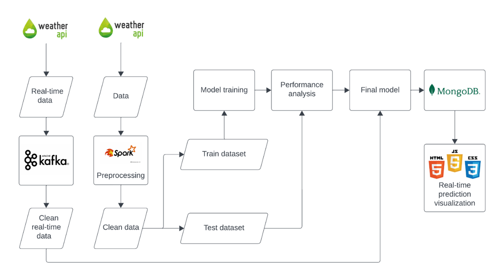
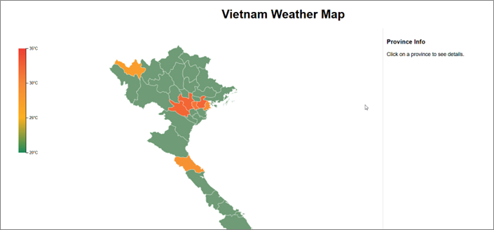
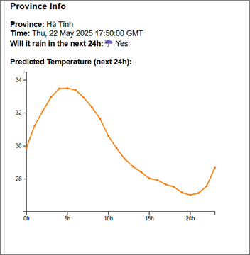

# Weather Web Application
A real-time weather forecasting application that combines weather data streaming with machine learning predictions for temperature forecasting in Vietnam.

## Table of Contents
- [Features](#features)
- [Technology Stack](#technology-stack)
- [Prerequisites](#prerequisites)
- [Installation](#installation)
- [Project Structure](#project-structure)
- [Running the Application](#running-the-application)
- [Data Flow](#data-flow)

## Features

- Real-time weather data streaming using Apache Kafka
- Machine learning-based temperature predictions for the next 24 hours
- Interactive visualization dashboard with Vietnam map integration
- MongoDB database for historical weather data storage
- RESTful API endpoints for weather data access

## Technology Stack

- **Data Streaming**: Apache Kafka
- **Database**: MongoDB
- **Machine Learning**: TensorFlow (RNN model for temperature prediction, Random Forest for raining prediction)
- **Frontend**: HTML, JavaScript with SVG visualization
- **Data Processing**: Pandas, Scikit-learn, Pyspark

## Prerequisites

- Python 3.11+
- Apache Kafka 3.9.0
- MongoDB 4.4+
- Java 11
- Weather API key from [weatherapi.com](https://www.weatherapi.com/)
- hadoop.dll and winutils.exe (for Windows users)

## Installation

1. Clone the repository
2. Sign up and get a free api key from [weatherapi.com](https://www.weatherapi.com/)
3. Create an .env file like this:
```bash
WEATHER_API_KEY=<YOUR_API_KEY>
```
4. Install Python dependencies:
```bash
pip install -r requirements.txt
```

5. Set up Kafka:
   - Download Kafka and extract the Kafka archive:
   ```bash
   cd kafka
   tar -xzf kafka_*.tgz
   ```
   - Start Zookeeper and Kafka servers (see Running section)

6. Start MongoDB server on your local machine (default port: 27017)

## Project Structure

```
Weather_Web/
├── backend/
│   ├── app.py              # Flask server with API endpoints
│   ├── static/             # Static files
│   └── templates/          # HTML templates
├── kafka/
│   ├── weather_producer.py # Kafka producer for weather data
│   ├── weather_consumer.py # Kafka consumer with ML predictions
│   └── cities.py          # City data configuration
└── model/
    └── model_rf/
    └── model_rnn/         # ML model files and scalers
```

## Running the Application

1. Start Kafka services:
```bash
# Start Zookeeper
cd kafka/kafExd/bin/windows
./zookeeper-server-start.bat ../../config/zookeeper.properties

# In a new terminal, start Kafka
cd kafka/kafExd/bin/windows
./kafka-server-start.bat ../../config/server.properties
```

2. Start the Kafka producer:
```bash
python kafka/weather_producer.py
```

3. Start the web application (this include Kafka comsumer):
```bash
python backend/app.py
```

5. Access the application at `http://localhost:5000`

## Data Flow
1. Weather Producer fetches real-time weather data
2. Data is streamed through Kafka
3. Consumer processes the data and makes predictions
4. Results are stored in MongoDB
5. Flask backend serves the processed data
6. Frontend visualizes the data on an interactive map

## System Architecture



## Web Interface


